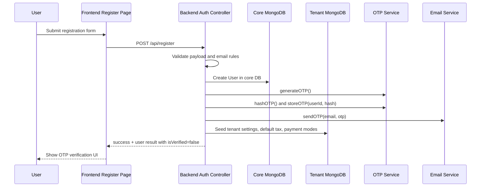
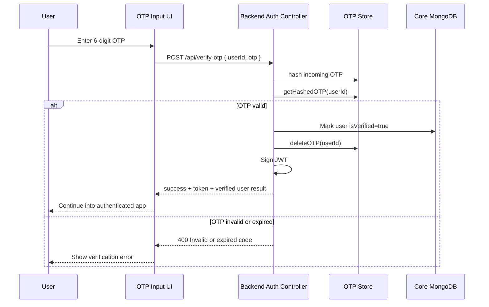
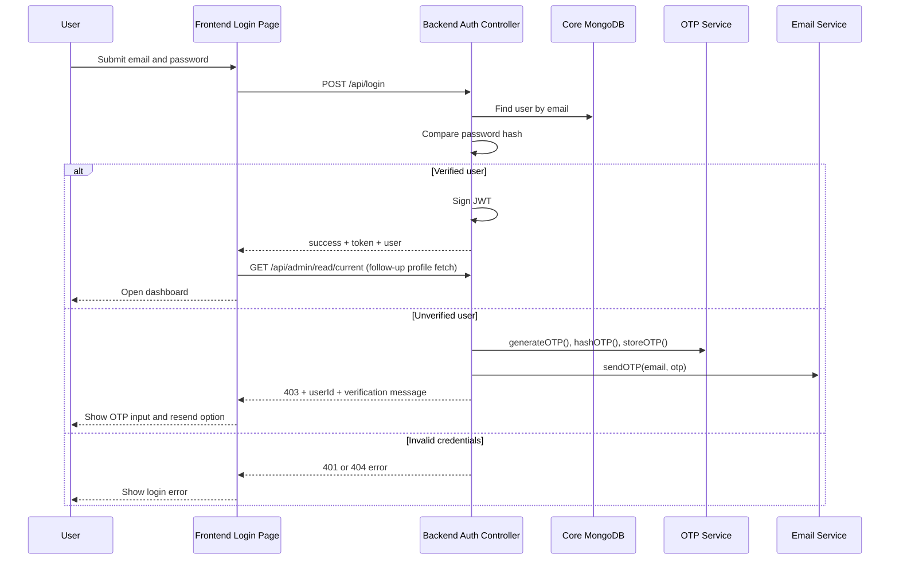
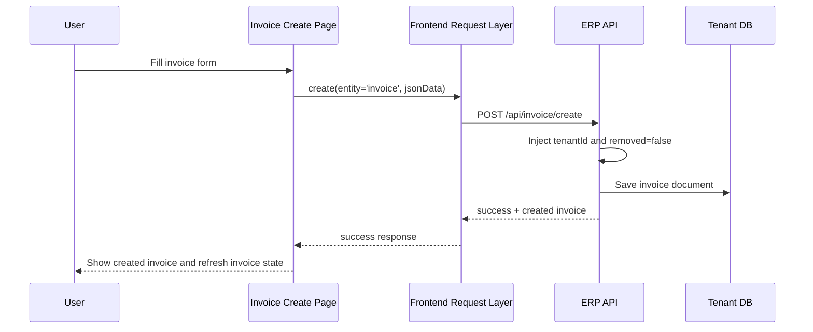
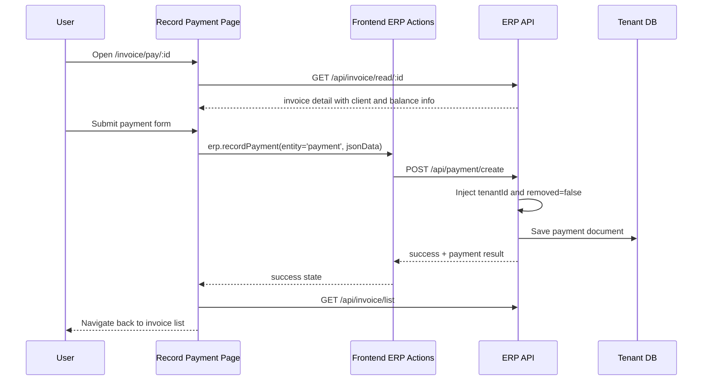

# BizCollab Project Replication Guide

## Purpose

This document captures the current repository structure and behavior of the BizCollab project so the application can be reproduced with minimal guesswork. It is written from the code that exists in this repository, not from a product brief.

Use this guide when you need to:

- understand the backend and frontend architecture
- recreate the same modules, pages, routes, and runtime behavior
- stand up a compatible local or containerized environment
- extend the system without breaking its current conventions

## Product Summary

BizCollab is a multi-tenant ERP/CRM application for small and medium businesses. It combines user onboarding, tenant-aware data isolation, customer management, invoicing, quotations, payments, tax configuration, app settings, profile management, and a dashboard in one stack.

The project is split into:

- a Node.js and Express backend in `backend/`
- a React and Vite frontend in `frontend/`
- a root workspace package used to run both apps together

## Technology Stack

### Backend

- Node.js 20.9.0
- Express 4
- MongoDB with Mongoose 8
- JWT authentication
- bcryptjs password hashing
- Redis for cache and OTP storage when available
- Nodemailer for OTP email delivery
- Socket.IO for realtime invoice updates
- Arcjet for request shielding, rate limits, and bot detection
- Pug and html-pdf for PDF generation

### Frontend

- React 18
- Vite 5
- React Router 6
- Redux and Redux Toolkit
- Ant Design 6
- Framer Motion
- Axios
- TailwindCSS 4 present in dependencies

### Tooling

- Nodemon for backend development
- concurrently in the root package for running both apps together
- Docker and Docker Compose support for production-style runs

## Workspace Layout

```text
Biz/
  backend/
    src/
      app.js
      server.js
      controllers/
      handlers/
      middlewares/
      models/
      repositories/
      routes/
      services/
      setup/
      utils/
  frontend/
    src/
      apps/
      auth/
      components/
      config/
      context/
      forms/
      hooks/
      locale/
      modules/
      pages/
      redux/
      request/
      router/
      settings/
      utils/
  Dockerfile
  docker-compose.yml
  README.md
  INSTALLATION-INSTRUCTIONS.md
```

## Runtime Topology

### Local Development

- frontend dev server runs on port `3000`
- backend server runs on port `8888`
- frontend talks to backend over HTTP API
- MongoDB stores the core database and tenant databases
- Redis is optional but used if reachable

### Production-Style Docker Build

The root `Dockerfile` uses a multi-stage build:

1. build the frontend with Node 20 Alpine
2. install backend production dependencies
3. copy the frontend build output into `backend/public`
4. start `backend/src/server.js`

In production mode, the backend serves the built frontend from `backend/public`.

## Core Architecture

### Multi-Tenant Design

This system uses database-per-tenant isolation.

- the core database stores global user accounts and core settings
- each business gets its own `tenantId`
- tenant-specific business data is stored in a separate MongoDB database
- the tenant database name is generated from an MD5 hash of the tenantId

The database switcher is implemented in `backend/src/utils/dbSwitch.js`.

Behavior:

- a UUID tenantId is created during registration
- `getTenantDB(tenantId)` derives a name like `biz_<16-char-hash>`
- business entities are resolved against that tenant database with `mongoose.connection.useDb(..., { useCache: true })`

### Backend Request Flow

Standard protected request flow:

1. request enters `backend/src/app.js`
2. security middleware runs
3. JWT auth middleware resolves the current user and tenantId
4. tenant middleware binds tenant-specific models
5. route handler calls controllers and repositories
6. response is returned as JSON

### Frontend Flow

Standard UI flow:

1. app bootstraps from `frontend/src/main.jsx`
2. the ERP shell is rendered through `frontend/src/apps/ErpApp.jsx`
3. routes are loaded from `frontend/src/router/routes.jsx`
4. feature pages dispatch Redux actions
5. auth and API traffic are handled through service and request layers

## Backend Application Structure

### Entry Files

- `backend/src/server.js`: server startup, MongoDB connection, Redis initialization, Socket.IO bootstrap, change stream wiring
- `backend/src/app.js`: Express app setup, middleware stack, API mounting, production static serving

### Middleware Stack

Configured in `backend/src/app.js`:

- `helmet`
- `morgan`
- `cors`
- `cookie-parser`
- JSON and URL-encoded parsers
- `compression`
- Arcjet shield on `/api`

Protected API groups are mounted with:

- `authMiddleware`
- `tenantMiddleware`

### Authentication and User Flow

Auth endpoints live in `backend/src/routes/authRoutes.js`.

Supported flows:

- register
- login
- verify OTP
- resend OTP
- complete setup

Important implementation details:

- passwords are hashed with bcryptjs
- JWT tokens are signed with `JWT_SECRET`
- unverified users are blocked from normal login completion
- OTP codes are generated, hashed, stored, and verified on the backend

### OTP and Verification Flow

Implemented mainly in:

- `backend/src/controllers/authController.js`
- `backend/src/utils/otpService.js`
- `backend/src/utils/emailService.js`

Behavior:

- OTP is a cryptographically secure 6 digit number
- OTP is hashed with SHA-256 before storage
- storage key format is `otp:<userId>`
- TTL is 10 minutes
- Redis is preferred, NodeCache is the fallback
- email is sent with Nodemailer using Gmail SMTP settings
- OTP is also logged to terminal during send flow, which is useful for testing

### Security Features

- JWT protected API routes
- Arcjet shield support for malicious request detection
- rate limiting on login flows
- bot protection on registration flow
- bcrypt password hashing
- tenant isolation at database level

### Caching

Caching is handled by `backend/src/middlewares/cache.js` and Redis setup in `backend/src/setup/redis.js`.

Used for:

- summary endpoints
- chart endpoints
- OTP storage

Fallback behavior:

- if Redis is unavailable, the application degrades gracefully
- OTP storage falls back to in-memory cache
- query caching is effectively disabled or limited without Redis

### Realtime Features

Implemented in `backend/src/server.js`.

Features:

- Socket.IO attached to the same HTTP server
- JWT-authenticated socket connections
- tenant-scoped rooms named `room:<tenantId>`
- MongoDB change stream on invoices
- realtime `invoice_change` events emitted to the correct tenant room

Constraint:

- MongoDB change streams require replica set support; when unavailable, the app logs a warning and continues without realtime invoice updates

## Backend Route Inventory

### Auth Routes

Defined in `backend/src/routes/authRoutes.js`:

- `POST /api/register`
- `POST /api/login`
- `POST /api/verify-otp`
- `POST /api/resend-otp`
- `POST /api/complete-setup`

### Core Routes

Defined in `backend/src/routes/coreRoutes/coreApi.js`:

- current admin read
- admin read by id
- password update
- profile password update
- profile update with upload
- settings CRUD and list/filter operations
- settings read/update by setting key
- settings upload
- settings bulk update

Concrete endpoints include:

- `GET /api/admin/read/current`
- `GET /api/admin/read/:id`
- `PATCH /api/admin/password-update/:id`
- `PATCH /api/admin/profile/password`
- `PATCH /api/admin/profile/update`
- `POST /api/setting/create`
- `GET /api/setting/read/:id`
- `PATCH /api/setting/update/:id`
- `GET /api/setting/search`
- `GET /api/setting/list`
- `GET /api/setting/listAll`
- `GET /api/setting/filter`
- `GET /api/setting/readBySettingKey/:settingKey`
- `GET /api/setting/listBySettingKey`
- `PATCH /api/setting/updateBySettingKey/:settingKey?`
- `PATCH /api/setting/upload/:settingKey?`
- `PATCH /api/setting/updateManySetting`

### ERP Entity Routes

Defined dynamically in `backend/src/routes/appRoutes/appApi.js` from model discovery in `backend/src/models/utils/index.js`.

Entities discovered from `backend/src/models/schemas/`:

- client
- invoice
- payment
- paymentmode
- quote
- setting
- taxes

For each entity, the backend exposes:

- `POST /api/<entity>/create`
- `GET /api/<entity>/read/:id`
- `PATCH /api/<entity>/update/:id`
- `DELETE /api/<entity>/delete/:id`
- `GET /api/<entity>/search`
- `GET /api/<entity>/list`
- `GET /api/<entity>/listAll`
- `GET /api/<entity>/filter`
- `GET /api/<entity>/summary`
- `GET /api/<entity>/chart`

Special cases:

- `POST /api/invoice/mail`
- `POST /api/quote/mail`
- `POST /api/payment/mail`
- `GET /api/quote/convert/:id`

## API Endpoint Reference

### Response Envelope Conventions

Most backend endpoints return JSON using one of these envelopes:

```json
{
  "success": true,
  "result": {},
  "message": "..."
}
```

```json
{
  "success": true,
  "result": [],
  "pagination": {
    "page": 1,
    "pages": 3,
    "count": 24
  },
  "message": "..."
}
```

Auth endpoints sometimes return `token`, `user`, or `result` instead of the generic entity envelope.

### Auth Endpoints

| Method | Path | Auth | Request Shape | Success Response Shape | Notes |
| --- | --- | --- | --- | --- | --- |
| POST | `/api/register` | No | `{ name, email, password, mobile, gstNumber?, country?, companyName? }` | `{ success, message, result: { _id, name, email, isVerified, tenantId, isEmailSent } }` | Creates user in core DB, seeds tenant DB, generates and sends OTP |
| POST | `/api/login` | No | `{ email, password }` | Verified user: `{ success, token, user: { _id, name, email, mobile, companyName, gstNumber, role, isSetupComplete, isVerified, tenantId } }` | Unverified user returns 403 with `{ success: false, message, userId }` and now also triggers OTP send |
| POST | `/api/verify-otp` | No | `{ userId, otp }` | `{ success, message, token, result: { _id, name, email, role, tenantId, isVerified, isSetupComplete } }` | Hashes incoming OTP and compares against Redis or local cache |
| POST | `/api/resend-otp` | No | `{ userId }` | `{ success, message }` | Generates and sends a new OTP if user exists and is not yet verified |
| POST | `/api/complete-setup` | Bearer token | `{ companyName, gstNumber, address }` | `{ success, result: <updated user document>, message }` | Marks onboarding complete and syncs `company_name` into tenant settings |

### Admin and Profile Endpoints

| Method | Path | Auth | Request Shape | Success Response Shape | Notes |
| --- | --- | --- | --- | --- | --- |
| GET | `/api/admin/read/current` | Bearer token | none | `{ success, result: { _id, enabled, email, name, mobile, companyName, gstNumber, photo, role }, message }` | Reads current authenticated user profile |
| GET | `/api/admin/read/:id` | Bearer token | path param `id` | `{ success, result: { _id, enabled, email, name, mobile, companyName, gstNumber, photo, role }, message }` | Reads a user/admin summary by id |
| PATCH | `/api/admin/profile/update` | Bearer token | multipart or JSON with `{ email, name, mobile, companyName, gstNumber, photo? }` | `{ success, result: { _id, enabled, email, name, mobile, companyName, gstNumber, photo, role }, message }` | Also syncs `company_name` and optionally `bizcollab_app_date_format` into settings |
| PATCH | `/api/admin/profile/password` | Bearer token | `{ password, passwordCheck }` | `{ success, result: {}, message }` | Validation errors may return `{ msg: ... }` instead of standard envelope |
| PATCH | `/api/admin/password-update/:id` | Bearer token | implementation-specific | likely `{ success, result, message }` | Exposed in routes, handled by admin controller wrapper |

### Setting Endpoints

| Method | Path | Auth | Request Shape | Success Response Shape | Notes |
| --- | --- | --- | --- | --- | --- |
| POST | `/api/setting/create` | Bearer token | `{ settingCategory, settingKey, settingValue, valueType?, enabled?, isPrivate?, isCoreSetting? }` | `{ success, result: <setting>, message }` | Generic create, tenantId injected automatically |
| GET | `/api/setting/read/:id` | Bearer token | path param `id` | `{ success, result: <setting>, message }` | Generic read |
| PATCH | `/api/setting/update/:id` | Bearer token | partial setting object | `{ success, result: <setting>, message }` | Generic update |
| GET | `/api/setting/search` | Bearer token | query: `q`, optional `fields=field1,field2` | `{ success, result: [<setting>], message }` | Returns HTTP 202 with empty result when no match |
| GET | `/api/setting/list` | Bearer token | query: `page`, `items`, `sortBy`, `sortValue`, `filter`, `equal`, `q`, `fields` | `{ success, result: [<setting>], pagination, message }` | Paginated list |
| GET | `/api/setting/listAll` | Bearer token | optional `sort` | `{ success, result: [<setting>], message }` | Custom version excludes private settings |
| GET | `/api/setting/filter` | Bearer token | query: `filter`, `equal` | `{ success, result: [<setting>], message }` | Exact match filter |
| GET | `/api/setting/readBySettingKey/:settingKey` | Bearer token | path param `settingKey` | `{ success, result: <setting>, message }` | Reads by setting key instead of id |
| GET | `/api/setting/listBySettingKey` | Bearer token | query: `settingKeyArray=key1,key2,key3` | `{ success, result: [<setting>], message }` | Fetches multiple settings by key |
| PATCH | `/api/setting/updateBySettingKey/:settingKey?` | Bearer token | `{ settingValue, settingCategory? }` | `{ success, result: <setting>, message }` | Upserts when missing |
| PATCH | `/api/setting/upload/:settingKey?` | Bearer token | multipart upload field `settingValue` | `{ success, result: <setting>, message }` | Uses same update-by-key behavior after upload middleware |
| PATCH | `/api/setting/updateManySetting` | Bearer token | `{ settings: [{ settingKey, settingValue }], settingCategory? }` | `{ success, result: [], message }` | Bulk upsert; also syncs `company_name` to `User.companyName` |

### Generic Entity Endpoint Contract

The following contract applies to the tenant-scoped entity routes generated by `backend/src/routes/appRoutes/appApi.js` and `backend/src/controllers/middlewaresControllers/createCRUDController/`.

Applicable entities in the current repo:

- `client`
- `invoice`
- `payment`
- `paymentmode`
- `quote`
- `setting`
- `taxes`

| Method | Path Pattern | Request Shape | Success Response Shape | Notes |
| --- | --- | --- | --- | --- |
| POST | `/api/<entity>/create` | JSON body matching entity schema | `{ success, result: <document>, message }` | `tenantId` and `removed=false` are injected server-side |
| GET | `/api/<entity>/read/:id` | path param `id` | `{ success, result: <document>, message }` | Reads one non-removed document in current tenant |
| PATCH | `/api/<entity>/update/:id` | partial JSON body for that entity | `{ success, result: <updated document>, message }` | Uses `runValidators: true` |
| DELETE | `/api/<entity>/delete/:id` | path param `id` | `{ success, result: <soft-deleted document>, message }` | Soft delete by setting `removed=true` |
| GET | `/api/<entity>/search` | query: `q`, optional `fields=field1,field2` | `{ success, result: [<document>], message }` | Uses regex search, default field is `name` |
| GET | `/api/<entity>/list` | query: `page`, `items`, `sortBy`, `sortValue`, `filter`, `equal`, `q`, `fields` | `{ success, result: [<document>], pagination: { page, pages, count }, message }` | Main paginated listing endpoint |
| GET | `/api/<entity>/listAll` | query: `sort`, optional `enabled` | `{ success, result: [<document>], message }` | Unpaginated list |
| GET | `/api/<entity>/filter` | query: `filter`, `equal` | `{ success, result: [<document>], message }` | Exact filter endpoint |
| GET | `/api/<entity>/summary` | optional query: `filter`, `equal` | `{ success, result: { countFilter, countAllDocs }, message }` | Summary count payload |
| GET | `/api/<entity>/chart` | entity-specific query or none | usually `{ success, result: [...], message }` | Explicitly implemented for invoice chart; other entities depend on controller support |

### Special ERP Endpoints

| Method | Path | Auth | Request Shape | Success Response Shape | Notes |
| --- | --- | --- | --- | --- | --- |
| POST | `/api/invoice/mail` | Bearer token | not currently used | `{ success, result: null, message }` | Current implementation returns premium upsell placeholder |
| POST | `/api/quote/mail` | Bearer token | not currently used | `{ success, result: null, message }` | Current implementation returns premium upsell placeholder |
| POST | `/api/payment/mail` | Bearer token | not currently used | `{ success, result: null, message }` | Current implementation returns premium upsell placeholder |
| GET | `/api/quote/convert/:id` | Bearer token | path param `id` | `{ success, result: null, message }` | Current implementation returns premium upsell placeholder |
| GET | `/api/invoice/chart` | Bearer token | no required params | `{ success, result: [{ name, revenue, expenses }], message }` | Returns last 12 months of invoice totals and payment collections |

### Example Success and Error Responses

This section gives concrete examples for every endpoint family in the current backend. For dynamic entity routes, one example applies to each entity that follows the shared CRUD controller contract.

#### `POST /api/register`

Success example:

```json
{
  "success": true,
  "message": "Account Created. Please verify your email with the OTP sent.",
  "result": {
    "_id": "65f0d7a2d6d6e3a1b2345678",
    "name": "Amit Sharma",
    "email": "amit@example.com",
    "isVerified": false,
    "tenantId": "c9e95d45-7c5b-46c0-96f3-111111111111",
    "isEmailSent": true
  }
}
```

Error examples:

```json
{
  "success": false,
  "message": "Email already exists."
}
```

```json
{
  "success": false,
  "message": "Invalid credentials.",
  "errorMessage": "\"password\" length must be at least 6 characters long"
}
```

```json
{
  "success": false,
  "message": "Setup Failed",
  "errorMessage": "<server error message>"
}
```

#### `POST /api/login`

Success example:

```json
{
  "success": true,
  "token": "<jwt>",
  "user": {
    "_id": "65f0d7a2d6d6e3a1b2345678",
    "name": "Amit Sharma",
    "email": "amit@example.com",
    "mobile": "9876543210",
    "companyName": "Acme Pvt Ltd",
    "gstNumber": "27ABCDE1234F1Z5",
    "role": "owner",
    "isSetupComplete": true,
    "isVerified": true,
    "tenantId": "c9e95d45-7c5b-46c0-96f3-111111111111"
  }
}
```

Error examples:

```json
{
  "success": false,
  "message": "User not found"
}
```

```json
{
  "success": false,
  "message": "Invalid credentials"
}
```

```json
{
  "success": false,
  "message": "Email not verified. A verification code has been sent to your email.",
  "userId": "65f0d7a2d6d6e3a1b2345678"
}
```

#### `POST /api/verify-otp`

Success example:

```json
{
  "success": true,
  "message": "Email verified successfully",
  "token": "<jwt>",
  "result": {
    "_id": "65f0d7a2d6d6e3a1b2345678",
    "name": "Amit Sharma",
    "email": "amit@example.com",
    "role": "owner",
    "tenantId": "c9e95d45-7c5b-46c0-96f3-111111111111",
    "isVerified": true,
    "isSetupComplete": false
  }
}
```

Error examples:

```json
{
  "success": false,
  "message": "User ID and OTP are required"
}
```

```json
{
  "success": false,
  "message": "Invalid or expired code"
}
```

```json
{
  "success": false,
  "message": "User not found"
}
```

#### `POST /api/resend-otp`

Success example:

```json
{
  "success": true,
  "message": "A new OTP has been sent to your email."
}
```

Error examples:

```json
{
  "success": false,
  "message": "Invalid request"
}
```

```json
{
  "success": false,
  "message": "Too many requests. Please try again in 15 minutes."
}
```

```json
{
  "success": false,
  "message": "Forbidden"
}
```

#### `POST /api/complete-setup`

Success example:

```json
{
  "success": true,
  "result": {
    "_id": "65f0d7a2d6d6e3a1b2345678",
    "companyName": "Acme Pvt Ltd",
    "gstNumber": "27ABCDE1234F1Z5",
    "address": "Mumbai",
    "isSetupComplete": true
  },
  "message": "Onboarding setup completed successfully!"
}
```

Error example:

```json
{
  "success": false,
  "message": "Company Name, GST Number, and Address are required."
}
```

#### `GET /api/admin/read/current`

Success example:

```json
{
  "success": true,
  "result": {
    "_id": "65f0d7a2d6d6e3a1b2345678",
    "enabled": true,
    "email": "amit@example.com",
    "name": "Amit Sharma",
    "mobile": "9876543210",
    "companyName": "Acme Pvt Ltd",
    "gstNumber": "27ABCDE1234F1Z5",
    "photo": "/uploads/profile.png",
    "role": "owner"
  },
  "message": "User profile retrieved successfully"
}
```

Error examples:

```json
{
  "success": false,
  "result": null,
  "message": "No user found with current token"
}
```

```json
{
  "success": false,
  "message": "Unauthorized: Invalid token"
}
```

#### `GET /api/admin/read/:id`

Success example:

```json
{
  "success": true,
  "result": {
    "_id": "65f0d7a2d6d6e3a1b2345678",
    "enabled": true,
    "email": "amit@example.com",
    "name": "Amit Sharma",
    "mobile": "9876543210",
    "companyName": "Acme Pvt Ltd",
    "gstNumber": "27ABCDE1234F1Z5",
    "photo": "/uploads/profile.png",
    "role": "owner"
  },
  "message": "we found this document "
}
```

Error example:

```json
{
  "success": false,
  "result": null,
  "message": "No document found "
}
```

#### `PATCH /api/admin/profile/update`

Success example:

```json
{
  "success": true,
  "result": {
    "_id": "65f0d7a2d6d6e3a1b2345678",
    "enabled": true,
    "email": "amit@example.com",
    "name": "Amit Sharma",
    "mobile": "9876543210",
    "companyName": "Acme Pvt Ltd",
    "gstNumber": "27ABCDE1234F1Z5",
    "photo": "/uploads/profile.png",
    "role": "owner"
  },
  "message": "we update this profile by this id: 65f0d7a2d6d6e3a1b2345678"
}
```

Error examples:

```json
{
  "success": false,
  "result": null,
  "message": "you couldn't update demo informations"
}
```

```json
{
  "success": false,
  "result": null,
  "message": "No profile found by this id: 65f0d7a2d6d6e3a1b2345678"
}
```

#### `PATCH /api/admin/profile/password`

Success example:

```json
{
  "success": true,
  "result": {},
  "message": "we update the password by this id: 65f0d7a2d6d6e3a1b2345678"
}
```

Error examples:

```json
{
  "msg": "Not all fields have been entered."
}
```

```json
{
  "msg": "The password needs to be at least 8 characters long."
}
```

```json
{
  "msg": "Enter the same password twice for verification."
}
```

```json
{
  "success": false,
  "result": null,
  "message": "User Password couldn't save correctly"
}
```

#### Settings Family Endpoints

Representative success example for `create`, `read`, `update`, `readBySettingKey`, and `updateBySettingKey`:

```json
{
  "success": true,
  "result": {
    "_id": "65f0d7a2d6d6e3a1b2345001",
    "tenantId": "c9e95d45-7c5b-46c0-96f3-111111111111",
    "enabled": true,
    "settingCategory": "company_settings",
    "settingKey": "company_name",
    "settingValue": "Acme Pvt Ltd",
    "valueType": "String",
    "isPrivate": false,
    "isCoreSetting": false
  },
  "message": "we update this document by this settingKey: company_name"
}
```

Representative list success example for `list`, `listAll`, `listBySettingKey`, `filter`, and `search`:

```json
{
  "success": true,
  "result": [
    {
      "settingKey": "company_name",
      "settingValue": "Acme Pvt Ltd"
    }
  ],
  "pagination": {
    "page": 1,
    "pages": 1,
    "count": 1
  },
  "message": "Successfully found all documents"
}
```

Bulk update success example for `PATCH /api/setting/updateManySetting`:

```json
{
  "success": true,
  "result": [],
  "message": "we update all settings"
}
```

Representative error examples:

```json
{
  "success": false,
  "result": null,
  "message": "No settingKey provided "
}
```

```json
{
  "success": false,
  "result": null,
  "message": "No settingValue provided "
}
```

```json
{
  "success": false,
  "result": [],
  "message": "No document found by this request"
}
```

```json
{
  "success": false,
  "result": null,
  "message": "Settings provided has Error"
}
```

#### Generic Entity Endpoints

These examples apply to the shared CRUD endpoints for `client`, `invoice`, `payment`, `paymentmode`, `quote`, `setting`, and `taxes`, except where a controller overrides the generic behavior.

Create success example for `POST /api/<entity>/create`:

```json
{
  "success": true,
  "result": {
    "_id": "65f0d7a2d6d6e3a1b2345999",
    "tenantId": "c9e95d45-7c5b-46c0-96f3-111111111111",
    "removed": false
  },
  "message": "Successfully Created the document in Model "
}
```

Read success example for `GET /api/<entity>/read/:id`:

```json
{
  "success": true,
  "result": {
    "_id": "65f0d7a2d6d6e3a1b2345999",
    "tenantId": "c9e95d45-7c5b-46c0-96f3-111111111111",
    "removed": false
  },
  "message": "we found this document "
}
```

Update success example for `PATCH /api/<entity>/update/:id`:

```json
{
  "success": true,
  "result": {
    "_id": "65f0d7a2d6d6e3a1b2345999",
    "tenantId": "c9e95d45-7c5b-46c0-96f3-111111111111",
    "removed": false
  },
  "message": "we update this document "
}
```

Delete success example for `DELETE /api/<entity>/delete/:id`:

```json
{
  "success": true,
  "result": {
    "_id": "65f0d7a2d6d6e3a1b2345999",
    "removed": true
  },
  "message": "Successfully Deleted the document "
}
```

Search success example for `GET /api/<entity>/search`:

```json
{
  "success": true,
  "result": [
    {
      "_id": "65f0d7a2d6d6e3a1b2345999"
    }
  ],
  "message": "Successfully found all documents"
}
```

Search no-result example:

```json
{
  "success": false,
  "result": [],
  "message": "No document found by this request"
}
```

Paginated list success example for `GET /api/<entity>/list`:

```json
{
  "success": true,
  "result": [
    {
      "_id": "65f0d7a2d6d6e3a1b2345999"
    }
  ],
  "pagination": {
    "page": 1,
    "pages": 5,
    "count": 42
  },
  "message": "Successfully found all documents"
}
```

List empty example:

```json
{
  "success": true,
  "result": [],
  "pagination": {
    "page": 1,
    "pages": 0,
    "count": 0
  },
  "message": "Collection is Empty"
}
```

ListAll success example for `GET /api/<entity>/listAll`:

```json
{
  "success": true,
  "result": [
    {
      "_id": "65f0d7a2d6d6e3a1b2345999"
    }
  ],
  "message": "Successfully found all documents"
}
```

Filter success example for `GET /api/<entity>/filter`:

```json
{
  "success": true,
  "result": [
    {
      "_id": "65f0d7a2d6d6e3a1b2345999"
    }
  ],
  "message": "Successfully found all documents  "
}
```

Filter error example:

```json
{
  "success": false,
  "result": null,
  "message": "filter not provided correctly"
}
```

Summary success example for `GET /api/<entity>/summary`:

```json
{
  "success": true,
  "result": {
    "countFilter": 10,
    "countAllDocs": 42
  },
  "message": "Successfully count all documents"
}
```

Read or update missing-document example:

```json
{
  "success": false,
  "result": null,
  "message": "No document found "
}
```

#### Invoice-Specific Overrides

Invoice delete success example for `DELETE /api/invoice/delete/:id`:

```json
{
  "success": true,
  "result": {
    "_id": "65f0d7a2d6d6e3a1b2346111",
    "removed": true
  },
  "message": "Invoice deleted successfully"
}
```

Invoice delete error example:

```json
{
  "success": false,
  "result": null,
  "message": "Invoice not found"
}
```

Invoice chart success example for `GET /api/invoice/chart`:

```json
{
  "success": true,
  "result": [
    { "name": "Apr", "revenue": 120000, "expenses": 75000 },
    { "name": "May", "revenue": 95000, "expenses": 84000 }
  ],
  "message": "Successfully fetched chart data"
}
```

#### Payment-Specific Overrides

Payment delete success example for `DELETE /api/payment/delete/:id`:

```json
{
  "success": true,
  "result": {
    "_id": "65f0d7a2d6d6e3a1b2346222",
    "removed": true
  },
  "message": "Successfully Deleted the document "
}
```

Payment delete error example:

```json
{
  "success": false,
  "result": null,
  "message": "No document found "
}
```

#### Premium Placeholder Endpoints

These responses currently apply to `POST /api/invoice/mail`, `POST /api/quote/mail`, `POST /api/payment/mail`, and `GET /api/quote/convert/:id`.

Success example:

```json
{
  "success": true,
  "result": null,
  "message": "Please Upgrade to Premium  Version to have full features"
}
```

## Frontend Page-to-API Mapping

This table maps the current frontend pages and key modules to the API endpoints they call directly or via Redux action wrappers.

| Frontend Page or Module | Primary Purpose | API Calls Used |
| --- | --- | --- |
| `/login` via `pages/Login.jsx` | sign in, trigger OTP for unverified users, resend OTP, verify OTP | `POST /api/login`, `POST /api/verify-otp`, `POST /api/resend-otp` |
| `/register` via `pages/Register.jsx` | account creation, OTP verification, resend OTP | `POST /api/register`, `POST /api/verify-otp`, `POST /api/resend-otp` |
| `/` via `modules/DashboardModule` | summary cards, charts, recent invoice data | `GET /api/invoice/summary`, `GET /api/client/summary`, `GET /api/invoice/chart`, `GET /api/invoice/list` |
| `/customer` via `pages/Customer/index.jsx` and `CrudModule` | list, search, create, update, read, delete customers | `GET /api/client/list`, `GET /api/client/search`, `POST /api/client/create`, `GET /api/client/read/:id`, `PATCH /api/client/update/:id`, `DELETE /api/client/delete/:id` |
| `/invoice` via `pages/Invoice/index.jsx` and `InvoiceDataTableModule` | list, search, read, update, delete invoices and route to payment page | `GET /api/invoice/list`, `GET /api/invoice/search`, `GET /api/invoice/read/:id`, `PATCH /api/invoice/update/:id`, `DELETE /api/invoice/delete/:id` |
| `/invoice/create` via `CreateInvoiceModule` | create invoice | `POST /api/invoice/create` |
| `/invoice/read/:id` via `ReadInvoiceModule` | view invoice detail | `GET /api/invoice/read/:id` |
| `/invoice/update/:id` via `UpdateInvoiceModule` | edit invoice | `GET /api/invoice/read/:id`, `PATCH /api/invoice/update/:id` |
| `/invoice/pay/:id` via `RecordPaymentModule` | fetch invoice, record payment against invoice | `GET /api/invoice/read/:id`, `POST /api/payment/create`, then `GET /api/invoice/list` after success |
| `/quote` via `pages/Quote/index.jsx` and `QuoteDataTableModule` | list, search, read, update, delete quotes | `GET /api/quote/list`, `GET /api/quote/search`, `GET /api/quote/read/:id`, `PATCH /api/quote/update/:id`, `DELETE /api/quote/delete/:id` |
| `/quote/create` via quote create module | create quote | `POST /api/quote/create` |
| `/quote/read/:id` via `ReadQuoteModule` | view quote detail | `GET /api/quote/read/:id` |
| `/quote/update/:id` via `UpdateQuoteModule` | edit quote | `GET /api/quote/read/:id`, `PATCH /api/quote/update/:id` |
| quote detail actions via ERP actions | convert quote or attempt to send mail | `GET /api/quote/convert/:id`, `POST /api/quote/mail` |
| `/payment` via `pages/Payment/index.jsx` and `PaymentDataTableModule` | list, search, read, update, delete payments | `GET /api/payment/list`, `GET /api/payment/search`, `GET /api/payment/read/:id`, `PATCH /api/payment/update/:id`, `DELETE /api/payment/delete/:id` |
| `/payment/read/:id` via `ReadPaymentModule` | view payment detail | `GET /api/payment/read/:id` |
| `/payment/update/:id` via payment update module | edit payment | `GET /api/payment/read/:id`, `PATCH /api/payment/update/:id`, usually followed by `GET /api/payment/list` |
| `/payment/mode` | manage payment modes | `GET /api/paymentmode/list`, `POST /api/paymentmode/create`, `PATCH /api/paymentmode/update/:id`, `DELETE /api/paymentmode/delete/:id` |
| `/taxes` | manage taxes | `GET /api/taxes/list`, `POST /api/taxes/create`, `PATCH /api/taxes/update/:id`, `DELETE /api/taxes/delete/:id` |
| `/settings` general/company/finance/currency tabs | load and bulk update settings | `GET /api/setting/listAll`, `PATCH /api/setting/updateManySetting`, `PATCH /api/setting/updateBySettingKey/:settingKey`, `PATCH /api/setting/upload/:settingKey` |
| profile pane inside settings and `/profile` related modules | fetch profile, update profile, update password | `GET /api/admin/read/current`, `PATCH /api/admin/profile/update`, `PATCH /api/admin/profile/password` |
| app bootstrap via `ErpApp.jsx` | load settings for app shell | `GET /api/setting/listAll` |

### Frontend Request Layer Conventions

- authenticated requests are sent through `frontend/src/request/request.js`
- `Authorization: Bearer <token>` is injected from persisted auth state
- CRUD-style pages use entity strings such as `client`, `invoice`, `payment`, `quote`, `paymentmode`, `taxes`, and `setting`
- profile updates use the composite entity path `admin/profile`
- password updates use `admin/profile/password/`

## Sequence Diagrams

The following Mermaid diagrams describe the current code flow for the main user and ERP operations.

### Register Flow



### Verify OTP Flow



### Login Flow



### Invoice Creation Flow



### Payment Recording Flow



### Representative Request Bodies by Entity

These examples are inferred from schema requirements and current frontend/backend expectations.

#### Client Create or Update

```json
{
  "name": "Acme Pvt Ltd",
  "email": "accounts@acme.test",
  "phone": "9876543210",
  "address": "Mumbai",
  "country": "India"
}
```

#### Invoice Create or Update

```json
{
  "createdBy": "<userObjectId>",
  "number": 1001,
  "year": 2026,
  "date": "2026-03-09T00:00:00.000Z",
  "expiredDate": "2026-03-16T00:00:00.000Z",
  "client": "<clientObjectId>",
  "items": [
    {
      "itemName": "Consulting",
      "description": "Monthly engagement",
      "quantity": 1,
      "price": 5000,
      "total": 5000
    }
  ],
  "taxRate": 18,
  "subTotal": 5000,
  "taxTotal": 900,
  "total": 5900,
  "currency": "INR",
  "discount": 0,
  "notes": "Net 7 days",
  "status": "draft"
}
```

#### Payment Create or Update

```json
{
  "createdBy": "<userObjectId>",
  "number": 1,
  "client": "<clientObjectId>",
  "invoice": "<invoiceObjectId>",
  "date": "2026-03-09T00:00:00.000Z",
  "amount": 5900,
  "currency": "INR",
  "paymentMode": "<paymentModeObjectId>",
  "ref": "UTR12345",
  "description": "Full payment received"
}
```

#### Quote Create or Update

```json
{
  "createdBy": "<userObjectId>",
  "number": 501,
  "year": 2026,
  "date": "2026-03-09T00:00:00.000Z",
  "expiredDate": "2026-03-20T00:00:00.000Z",
  "client": "<clientObjectId>",
  "items": [
    {
      "itemName": "Implementation",
      "description": "ERP rollout",
      "quantity": 1,
      "price": 25000,
      "total": 25000
    }
  ],
  "taxRate": 18,
  "subTotal": 25000,
  "taxTotal": 4500,
  "total": 29500,
  "currency": "INR",
  "discount": 0,
  "notes": "Valid for 10 days",
  "status": "draft"
}
```

#### Payment Mode Create or Update

```json
{
  "enabled": true,
  "name": "UPI / QR Scan",
  "description": "GPay, PhonePe, Paytm, BHIM",
  "ref": "upi",
  "isDefault": false
}
```

#### Tax Create or Update

```json
{
  "enabled": true,
  "taxName": "GST 18%",
  "taxValue": 18,
  "isDefault": false
}
```

## Database Schema Reference

### Core Database Model: User

Collection model: `User`

| Field | Type | Required | Default | Notes |
| --- | --- | --- | --- | --- |
| `name` | String | Yes | none | User display name |
| `email` | String | Yes | none | Unique across the whole system |
| `password` | String | Yes | none | bcrypt hash stored in core DB |
| `mobile` | String | Yes | none | User phone number |
| `tenantId` | String | Yes | `uuidv4()` | Unique tenant key used to derive tenant DB name |
| `isSetupComplete` | Boolean | No | `false` | Onboarding completion flag |
| `isVerified` | Boolean | No | `false` | Email OTP verification flag |
| `companyName` | String | No | `""` | Also synced into tenant settings |
| `gstNumber` | String | No | `""` | Business tax identifier |
| `address` | String | No | `""` | Company address used during setup |
| `photo` | String | No | none | Profile image path or URL |
| `role` | String | No | `owner` | Enum: `superadmin`, `owner`, `admin`, `manager`, `employee`, `create_only`, `read_only` |
| `enabled` | Boolean | No | `true` | Access flag |
| `removed` | Boolean | No | `false` | Soft delete flag |
| `createdAt` | Date | Auto | timestamps | Mongoose timestamp |
| `updatedAt` | Date | Auto | timestamps | Mongoose timestamp |

### Tenant Database Model: Client

| Field | Type | Required | Default | Notes |
| --- | --- | --- | --- | --- |
| `tenantId` | String | Yes | none | Indexed tenant isolation field |
| `name` | String | Yes | none | Client name |
| `email` | String | Yes | none | Lowercased and trimmed |
| `phone` | String | Yes | none | Primary contact number |
| `address` | String | No | none | Postal or billing address |
| `country` | String | No | none | Country label |
| `created` | Date | No | `Date.now` | Legacy created field |
| `removed` | Boolean | No | `false` | Soft delete flag |
| `createdAt` | Date | Auto | timestamps | Timestamp |
| `updatedAt` | Date | Auto | timestamps | Timestamp |

### Tenant Database Model: Invoice

| Field | Type | Required | Default | Notes |
| --- | --- | --- | --- | --- |
| `removed` | Boolean | No | `false` | Soft delete flag |
| `tenantId` | String | Yes | none | Indexed tenant isolation field |
| `createdBy` | ObjectId `User` | Yes | none | Creator reference |
| `number` | Number | Yes | none | Invoice sequence number |
| `year` | Number | Yes | none | Sequence year |
| `content` | String | No | none | Freeform body content |
| `recurring` | String | No | none | Enum: `daily`, `weekly`, `monthly`, `annually`, `quarter` |
| `date` | Date | Yes | none | Invoice issue date |
| `expiredDate` | Date | Yes | none | Due date |
| `client` | ObjectId `Client` | Yes | none | Autopopulated client reference |
| `converted.from` | String | No | none | Source type: `quote` or `offer` |
| `converted.offer` | ObjectId | No | none | Optional legacy offer reference |
| `converted.quote` | ObjectId `Quote` | No | none | Quote source reference |
| `items[]` | Array | Yes | none | Line items array |
| `items[].itemName` | String | Yes | none | Item title |
| `items[].description` | String | No | none | Item detail |
| `items[].quantity` | Number | Yes | `1` | Quantity |
| `items[].price` | Number | Yes | none | Unit price |
| `items[].total` | Number | Yes | none | Line total |
| `taxRate` | Number | No | `0` | Applied tax percentage |
| `subTotal` | Number | No | `0` | Total before tax |
| `taxTotal` | Number | No | `0` | Calculated tax amount |
| `total` | Number | No | `0` | Final total |
| `currency` | String | Yes | `NA` | Uppercased currency code |
| `credit` | Number | No | `0` | Credit adjustment |
| `discount` | Number | No | `0` | Discount amount |
| `payment[]` | Array of ObjectId `Payment` | No | none | Related payments |
| `paymentStatus` | String | No | `unpaid` | Enum: `unpaid`, `paid`, `partially` |
| `isOverdue` | Boolean | No | `false` | Overdue flag |
| `approved` | Boolean | No | `false` | Approval flag |
| `notes` | String | No | none | Internal or client notes |
| `status` | String | No | `draft` | Enum: `draft`, `pending`, `sent`, `refunded`, `cancelled`, `on hold` |
| `pdf` | String | No | none | Generated PDF path |
| `files[]` | Array | No | none | Attached file metadata |
| `files[].id` | String | No | none | Attachment id |
| `files[].name` | String | No | none | Attachment name |
| `files[].path` | String | No | none | Attachment path |
| `files[].description` | String | No | none | Attachment description |
| `files[].isPublic` | Boolean | No | `true` | Public visibility flag |
| `updated` | Date | No | `Date.now` | Legacy updated field |
| `created` | Date | No | `Date.now` | Legacy created field |

### Tenant Database Model: Payment

| Field | Type | Required | Default | Notes |
| --- | --- | --- | --- | --- |
| `removed` | Boolean | No | `false` | Soft delete flag |
| `tenantId` | String | Yes | none | Indexed tenant isolation field |
| `createdBy` | ObjectId `User` | Yes | none | Autopopulated user reference |
| `number` | Number | Yes | none | Payment sequence number |
| `client` | ObjectId `Client` | Yes | none | Autopopulated client reference |
| `invoice` | ObjectId `Invoice` | Yes | none | Autopopulated invoice reference |
| `date` | Date | Yes | `Date.now` | Payment date |
| `amount` | Number | Yes | none | Amount paid |
| `currency` | String | Yes | `NA` | Uppercased currency code |
| `paymentMode` | ObjectId `PaymentMode` | No | none | Autopopulated payment mode reference |
| `ref` | String | No | none | External payment reference |
| `description` | String | No | none | Payment note |
| `updated` | Date | No | `Date.now` | Legacy updated field |
| `created` | Date | No | `Date.now` | Legacy created field |

### Tenant Database Model: PaymentMode

| Field | Type | Required | Default | Notes |
| --- | --- | --- | --- | --- |
| `removed` | Boolean | No | `false` | Soft delete flag |
| `tenantId` | String | Yes | none | Indexed tenant isolation field |
| `enabled` | Boolean | No | `true` | Enables or disables the mode |
| `name` | String | Yes | none | Display name |
| `description` | String | Yes | none | Human-readable explanation |
| `ref` | String | No | none | Optional short code |
| `isDefault` | Boolean | No | `false` | Default payment mode flag |
| `created` | Date | No | `Date.now` | Legacy created field |
| `createdAt` | Date | Auto | timestamps | Timestamp |
| `updatedAt` | Date | Auto | timestamps | Timestamp |

### Tenant Database Model: Quote

| Field | Type | Required | Default | Notes |
| --- | --- | --- | --- | --- |
| `removed` | Boolean | No | `false` | Soft delete flag |
| `tenantId` | String | Yes | none | Indexed tenant isolation field |
| `createdBy` | ObjectId `User` | Yes | none | Quote creator |
| `converted` | Boolean | No | `false` | Indicates whether it has been converted |
| `number` | Number | Yes | none | Quote sequence number |
| `year` | Number | Yes | none | Sequence year |
| `content` | String | No | none | Freeform content |
| `date` | Date | Yes | none | Quote date |
| `expiredDate` | Date | Yes | none | Expiration date |
| `client` | ObjectId `Client` | Yes | none | Autopopulated client reference |
| `items[]` | Array | Yes | none | Quote line items |
| `items[].itemName` | String | Yes | none | Item title |
| `items[].description` | String | No | none | Item detail |
| `items[].quantity` | Number | Yes | none | Quantity |
| `items[].price` | Number | Yes | none | Unit price |
| `items[].total` | Number | Yes | none | Line total |
| `taxRate` | Number | No | none | Applied tax percentage |
| `subTotal` | Number | No | none | Total before tax |
| `taxTotal` | Number | No | none | Tax amount |
| `total` | Number | No | none | Final total |
| `credit` | Number | No | `0` | Credit adjustment |
| `currency` | String | Yes | `NA` | Uppercased currency code |
| `discount` | Number | No | `0` | Discount amount |
| `notes` | String | No | none | Additional notes |
| `status` | String | No | `draft` | Enum: `draft`, `pending`, `sent`, `accepted`, `declined`, `cancelled`, `on hold` |
| `approved` | Boolean | No | `false` | Approval flag |
| `isExpired` | Boolean | No | `false` | Expiration state |
| `pdf` | String | No | none | Generated PDF path |
| `files[]` | Array | No | none | Attached file metadata |
| `files[].id` | String | No | none | Attachment id |
| `files[].name` | String | No | none | Attachment name |
| `files[].path` | String | No | none | Attachment path |
| `files[].description` | String | No | none | Attachment description |
| `files[].isPublic` | Boolean | No | `true` | Public visibility flag |
| `updated` | Date | No | `Date.now` | Legacy updated field |
| `created` | Date | No | `Date.now` | Legacy created field |

### Tenant Database Model: Setting

| Field | Type | Required | Default | Notes |
| --- | --- | --- | --- | --- |
| `removed` | Boolean | No | `false` | Soft delete flag |
| `tenantId` | String | Yes | none | Indexed tenant isolation field |
| `enabled` | Boolean | No | `true` | Whether the setting is active |
| `settingCategory` | String | Yes | none | Lowercased category key |
| `settingKey` | String | Yes | none | Lowercased unique-ish config key within tenant |
| `settingValue` | Mixed | No | none | Arbitrary scalar or object value |
| `valueType` | String | No | `String` | Human-readable type label |
| `isPrivate` | Boolean | No | `false` | Hidden from public listAll |
| `isCoreSetting` | Boolean | No | `false` | Marks core/global style settings |
| `createdAt` | Date | Auto | timestamps | Timestamp |
| `updatedAt` | Date | Auto | timestamps | Timestamp |

### Tenant Database Model: Taxes

| Field | Type | Required | Default | Notes |
| --- | --- | --- | --- | --- |
| `removed` | Boolean | No | `false` | Soft delete flag |
| `tenantId` | String | Yes | none | Indexed tenant isolation field |
| `enabled` | Boolean | No | `true` | Whether the tax is available |
| `taxName` | String | Yes | none | Display tax label |
| `taxValue` | Number | Yes | none | Tax percentage or value |
| `isDefault` | Boolean | No | `false` | Default tax flag |
| `created` | Date | No | `Date.now` | Legacy created field |
| `createdAt` | Date | Auto | timestamps | Timestamp |
| `updatedAt` | Date | Auto | timestamps | Timestamp |

### Schema Design Notes

- every tenant-scoped schema includes `tenantId` and `removed`
- most CRUD deletion is soft deletion, not hard deletion
- several schemas mix Mongoose timestamps with legacy `created` and `updated` fields, so both may exist in stored documents
- invoice, payment, and quote use `mongoose-autopopulate` for reference fields
- `Setting.settingValue` is mixed type, so frontend code must tolerate strings, booleans, numbers, arrays, or objects depending on the key
- `User.tenantId` is central to routing data into the correct database and should be treated as an immutable partition key

## Backend Feature Inventory

### User and Access Features

- account registration
- email verification by OTP
- login and JWT session issuance
- resend verification code
- post-registration company setup
- profile read and update
- password update

### Dashboard and Reporting Features

- dashboard metrics and summaries
- chart endpoints for business entities
- tenant-specific visibility of business data

### Customer Features

- customer listing
- customer creation and editing
- customer filtering and search
- customer summary views

### Invoice Features

- invoice CRUD
- invoice read pages
- invoice payment recording
- invoice summary and chart endpoints
- invoice email sending
- invoice PDF generation support
- realtime invoice update notifications

### Quote Features

- quote CRUD
- quote read and update
- quote email sending
- quote conversion to invoice
- quote summary and chart endpoints

### Payment Features

- payment CRUD
- payment read and update
- payment summary and chart endpoints
- payment email sending

### Payment Mode Features

- payment mode listing and management
- seeded default payment modes during tenant setup

### Tax Features

- tax listing and management
- default tax seeded during tenant creation

### Settings Features

- app settings
- company settings
- finance settings
- client settings
- invoice settings
- quote settings
- money format settings
- company logo and asset-related settings

## Backend Data and Setup Behavior

### Core Data

The core database stores:

- users
- core-level settings

### Tenant Data

Each tenant database stores business entities such as:

- clients
- invoices
- quotes
- payments
- taxes
- payment modes
- settings

### Setup Scripts

Defined in `backend/package.json`:

- `npm run setup`
- `npm run upgrade`
- `npm run reset`

`backend/src/setup/setup.js` does the following:

- connects to the core MongoDB database
- creates a super admin account if missing
- seeds core settings from `backend/src/setup/setupConfig.json`

Default setup admin created by script:

- email: `admin@bizcollab.com`
- password: `admin123`

### Tenant Initialization During Registration

When a new business account registers, the backend also:

- creates the user record in the core database
- creates a tenantId
- seeds tenant settings from JSON files under `backend/src/setup/defaultSettings/`
- creates a default tax record
- creates default payment mode records

Default tenant settings source files:

- `appSettings.json`
- `clientSettings.json`
- `companySettings.json`
- `financeSettings.json`
- `invoiceSettings.json`
- `moneyFormatSettings.json`
- `quoteSettings.json`

## Frontend Application Structure

### Main Shell

The frontend shell is centered around:

- `frontend/src/apps/ErpApp.jsx`
- `frontend/src/apps/Header/`
- `frontend/src/apps/Navigation/NavigationContainer.jsx`
- `frontend/src/router/AppRouter.jsx`

The app uses a dark glassmorphism-style layout with:

- a collapsible desktop sidebar
- a drawer-based mobile menu
- animated background effects
- routed content area

### Frontend Route Inventory

Defined in `frontend/src/router/routes.jsx`.

Primary routes:

- `/`
- `/login`
- `/logout`
- `/about`
- `/customer`
- `/invoice`
- `/invoice/create`
- `/invoice/read/:id`
- `/invoice/update/:id`
- `/invoice/pay/:id`
- `/quote`
- `/quote/create`
- `/quote/read/:id`
- `/quote/update/:id`
- `/payment`
- `/payment/read/:id`
- `/payment/update/:id`
- `/settings`
- `/settings/edit/:settingsKey`
- `/payment/mode`
- `/taxes`
- `/profile`
- catch-all not found route

### Frontend Navigation Sections

Sidebar items defined in `frontend/src/apps/Navigation/NavigationContainer.jsx`:

- Dashboard
- Customers
- Invoices
- Quote
- Payments
- Payments Mode
- Taxes
- Settings
- About

Related user pages also include:

- Login
- Register
- Forget Password
- Reset Password
- Logout
- Profile
- Not Found

### Frontend Pages by Section

#### Authentication Section

- `Login.jsx`
- `Register.jsx`
- `ForgetPassword.jsx`
- `ResetPassword.jsx`
- `Logout.jsx`

Features:

- sign in
- sign up
- OTP verification UI
- resend OTP
- password reset flow scaffolding

#### Dashboard Section

- `Dashboard.jsx`

Features:

- business overview
- summary widgets
- charts and KPI-style data

#### Customer Section

- `pages/Customer/index.jsx`

Features:

- customer listing
- CRUD-driven customer management

#### Invoice Section

- `pages/Invoice/index.jsx`
- `pages/Invoice/InvoiceCreate.jsx`
- `pages/Invoice/InvoiceRead.jsx`
- `pages/Invoice/InvoiceUpdate.jsx`
- `pages/Invoice/InvoiceRecordPayment.jsx`

Features:

- invoice creation
- invoice viewing
- invoice editing
- invoice payment recording

#### Quote Section

- `pages/Quote/index.jsx`
- `pages/Quote/QuoteCreate.jsx`
- `pages/Quote/QuoteRead.jsx`
- `pages/Quote/QuoteUpdate.jsx`

Features:

- quote creation
- quote viewing
- quote editing
- quote to invoice conversion support via backend

#### Payment Section

- `pages/Payment/index.jsx`
- `pages/Payment/PaymentRead.jsx`
- `pages/Payment/PaymentUpdate.jsx`

Features:

- payment listing
- payment detail view
- payment editing

#### Settings Section

- `pages/Settings/Settings.jsx`
- `pages/Settings/GeneralSettings.jsx`
- `pages/Settings/CompanySettings.jsx`
- `pages/Settings/CompanyLogoSettings.jsx`
- `pages/Settings/FinanceSettings.jsx`
- `pages/Settings/MoneyFormatSettings.jsx`

Features:

- general settings management
- company details settings
- logo upload and branding settings
- finance settings
- money formatting settings

#### Payment Mode Section

- `pages/PaymentMode/index.jsx`

Features:

- payment method configuration

#### Taxes Section

- `pages/Taxes/index.jsx`

Features:

- tax configuration

#### Profile Section

- `pages/Profile.jsx`

Features:

- current user profile view
- profile updates
- password updates

#### About Section

- `pages/About.jsx`

## Frontend Module Inventory

Modules under `frontend/src/modules/`:

- `AuthModule`
- `CrudModule`
- `DashboardModule`
- `ErpPanelModule`
- `InvoiceModule`
- `PaymentModule`
- `ProfileModule`
- `QuoteModule`
- `SettingModule`

These modules act as container and orchestration layers around page-level features.

## Frontend Shared Components

Notable reusable components include:

- `CommandPalette`
- `OTPInput`
- `CreateForm`
- `CrudModal`
- `DataTable`
- `DeleteModal`
- `Loading`
- `AutoCompleteAsync`
- `CollapseBox`
- `IconMenu`

These components support the CRUD-heavy behavior of the app.

## Frontend State Management

Redux structure under `frontend/src/redux/` includes:

- `auth`
- `crud`
- `adavancedCrud`
- `erp`
- `settings`

Expected roles:

- `auth`: user session, token, verification state, auth loading state
- `crud`: common entity CRUD handling
- `adavancedCrud`: richer CRUD flows used by more complex modules
- `erp`: ERP-specific data handling
- `settings`: app and business settings

The app also persists important client state through `storePersist`.

## Frontend Service and Request Layer

Important folders:

- `frontend/src/auth/`
- `frontend/src/request/`

Responsibilities:

- auth-specific API calls
- generic request wrappers
- centralized success handling
- centralized error handling
- auth-related response shaping

## Localization and Settings

The repo includes localization and runtime settings support in both backend and frontend.

Relevant folders:

- `backend/src/locale/`
- `frontend/src/locale/`
- `backend/src/settings/`
- `frontend/src/settings/`

This suggests the UI is expected to support translatable strings and configurable formatting such as date and money display.

## Environment Variables Required for Replication

At minimum, the backend expects these environment variables to be defined correctly:

```env
DATABASE=mongodb://<host>:27017/BizCollab_core
PORT=8888
JWT_SECRET=<secure-secret>
NODE_ENV=development
PUBLIC_SERVER_FILE=http://localhost:8888/
```

Recommended additional variables for full behavior:

```env
REDIS_URL=redis://localhost:6379
FRONTEND_URL=http://localhost:3000
GMAIL_USER=<gmail-address>
GMAIL_PASS=<gmail-app-password>
ARCJET_KEY=<arcjet-key>
ARCJET_ENV=development
OPENSSL_CONF=/dev/null
```

Notes:

- use Gmail app passwords for Nodemailer if Gmail SMTP is enabled
- do not hardcode secrets in source control
- `NODE_ENV=development` is useful for local OTP testing

## Local Replication Steps

### Prerequisites

- Node.js 20.9.0
- npm 10.2.4
- MongoDB running locally or reachable remotely
- optional Redis instance

### Backend Setup

```bash
cd backend
npm install
npm run setup
npm run dev
```

### Frontend Setup

```bash
cd frontend
npm install
npm run dev
```

### Combined Run from Root

```bash
npm install
npm run install:all
npm run dev
```

## Docker Replication Steps

### Build and Start

```bash
docker compose up --build
```

Current Compose behavior:

- starts MongoDB
- starts the app container on port `8888`
- points backend to the MongoDB container

Important caveat:

- the provided compose file does not define a Redis service
- the app can still run, but Redis-backed features fall back where supported

## Exact Replication Checklist

To recreate the project behavior accurately, preserve all of the following:

- Node 20 runtime
- MongoDB core database plus tenant database switching model
- JWT authentication with tenant-aware middleware
- OTP registration and verification flow
- Redis optional dependency with graceful fallback
- dynamic entity route generation from model schemas
- React router path structure listed above
- Redux auth, CRUD, ERP, and settings slices
- sidebar sections and pages listed above
- default settings JSON seeding during tenant creation
- default payment modes and default tax seeding
- Socket.IO tenant room strategy for invoice updates
- production static serving of frontend build from backend/public

## Known Caveats and Implementation Notes

- the project uses a database-per-tenant model instead of a shared collection model
- the backend dynamically generates ERP routes from schema files, so entity naming conventions matter
- production Docker currently bundles the built frontend into the backend image
- Redis is optional in the current codebase, but some behavior is better with it enabled
- MongoDB change streams require replica set support for realtime invoice updates
- OTP is intentionally easy to inspect in development because it is logged during send flow
- some frontend behavior depends on Redux state transitions, so auth and loading reducers are part of the effective product behavior

## Recommended Files to Read First When Extending the Project

### Backend

- `backend/src/server.js`
- `backend/src/app.js`
- `backend/src/controllers/authController.js`
- `backend/src/routes/authRoutes.js`
- `backend/src/routes/appRoutes/appApi.js`
- `backend/src/routes/coreRoutes/coreApi.js`
- `backend/src/models/utils/index.js`
- `backend/src/utils/dbSwitch.js`

### Frontend

- `frontend/src/apps/ErpApp.jsx`
- `frontend/src/apps/Navigation/NavigationContainer.jsx`
- `frontend/src/router/routes.jsx`
- `frontend/src/router/AppRouter.jsx`
- `frontend/src/redux/auth/`
- `frontend/src/request/`
- `frontend/src/pages/`

## Final Replication Summary

If you want to reproduce this project without changing its architecture, the essentials are:

- one React SPA frontend
- one Express backend
- one core MongoDB database
- one tenant database per business account
- JWT-based auth
- OTP verification for onboarding
- generic CRUD endpoints generated from schema files
- a dashboard plus customer, invoice, quote, payment, payment mode, tax, settings, profile, and about sections
- optional Redis and Socket.IO integrations

This repository already contains the blueprint for that exact system. Rebuilding it accurately means preserving the route structure, tenant strategy, seeded defaults, auth lifecycle, and feature pages described above.